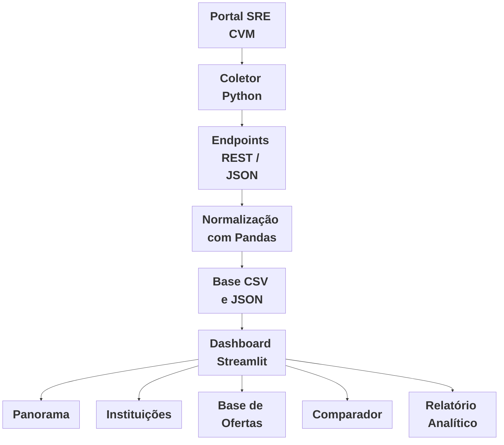

# Agente Inteligente de Análise e Contextualização de Ofertas Primárias.

Projeto desenvolvido como membro da liga Inteli Academy em parceria com o **BTG Pactual**, com o objetivo de apoiar a análise de ofertas primárias a partir de dados públicos disponibilizados no portal **SRE da CVM**.

A solução coleta dados de ofertas públicas via endpoints REST, organiza as informações em uma base estruturada e disponibiliza um dashboard interativo para análise por tipo de ativo, emissor, instituição coordenadora, status e volume. O sistema também conta com uma visão comparativa entre ofertas e geração automática de relatório analítico.

---

## Objetivo do projeto

Criar um MVP de um agente analítico capaz de:

- Coletar dados públicos de ofertas primárias no portal SRE da CVM.
- Organizar os dados em uma base estruturada.
- Permitir análise por tipo de ativo, emissor, coordenador líder, status e volume.
- Comparar ofertas com base nos dados disponíveis.
- Gerar uma síntese automática para apoiar a priorização da análise.

---

## Fonte dos dados

**Portal SRE CVM:**
https://web.cvm.gov.br/sre-publico-cvm/#/consulta-oferta-publica

O portal utiliza endpoints REST com retorno em JSON. A coleta é feita diretamente via requisições HTTP, sem necessidade de Selenium ou scraping visual.

---

## Arquitetura da solução



---

## Tecnologias utilizadas

| Tecnologia | Uso |
|---|---|
| Python | Linguagem principal. |
| Requests | Consumo dos endpoints da CVM. |
| Pandas | Tratamento, limpeza e estruturação dos dados. |
| Streamlit | Dashboard interativo. |
| Plotly | Gráficos e visualizações. |
| python-dotenv | Gerenciamento de variáveis de ambiente. |
| pypdf | Leitura futura de prospectos em PDF. |
| LangChain / LLM | Previsto nas próximas evoluções. |

---

## Estrutura do projeto

```
agente-btg/
│
├── app.py                    # Dashboard em Streamlit
├── coletar_dados.py          # Script de coleta dos dados da CVM
├── requirements.txt          # Dependências do projeto
│
├── src/
│   ├── analyzer.py           # Resumo de mercado, detecção de discrepâncias e filtro BTG.
│   ├── cvm_client.py         # Funções de requisição: busca, detalhes, participantes e info de oferta.
│   ├── normalizer.py         # Normalização e mapeamento de colunas da base da CVM.
│   └── report_agent.py       # Geração do relatório analítico textual.
│
├── data/
│   ├── ofertas_cvm.csv       # Base principal usada pelo dashboard
│   ├── ofertas_cvm.json      # Base principal em JSON
│   ├── detalhes_cvm.csv      # Detalhes completos por oferta (CSV)
│   └── detalhes_cvm.json     # Detalhes completos por oferta (JSON)
│
├── notebooks/                # Notebooks de exploração e análise
│
└── .venv/                    # Ambiente virtual (não versionar)
```

### Principais arquivos

| Arquivo | Função |
|---|---|
| `app.py` | Dashboard em Streamlit com 5 páginas. |
| `coletar_dados.py` | Coleta, pagina e salva os dados da CVM. |
| `src/cvm_client.py` | Funções de requisição: busca, detalhes, participantes e info de oferta. |
| `data/ofertas_cvm.csv` | Base principal lida pelo dashboard. |
| `data/detalhes_cvm.json` | Detalhes completos de cada oferta coletada. |

---

## Como rodar o projeto

### 1. Clonar o repositório

```bash
git clone LINK_DO_REPOSITORIO
cd agente-btg
```

### 2. Criar e ativar ambiente virtual

```bash
python -m venv .venv
```

PowerShell:
```bash
.venv\Scripts\activate
```

Git Bash:
```bash
source .venv/Scripts/activate
```

### 3. Instalar dependências

```bash
python -m pip install -r requirements.txt
```

Ou manualmente:
```bash
python -m pip install pandas requests streamlit plotly python-dotenv pypdf langchain langchain-openai
```

### 4. Coletar os dados da CVM

```bash
python coletar_dados.py
```

Arquivos gerados em `data/`:

```
data/ofertas_cvm.csv
data/ofertas_cvm.json
data/detalhes_cvm.csv
data/detalhes_cvm.json
```

### 5. Rodar o dashboard

```bash
python -m streamlit run app.py
```

---

## Configuração da coleta

Todos os parâmetros de coleta ficam no arquivo `coletar_dados.py` e podem ser ajustados sem mexer em nenhum outro arquivo.

### Número de páginas e ofertas por página

A quantidade de registros coletados depende de dois parâmetros:

```python
# Dentro de PAYLOAD_BUSCA
"tamanhoPagina": "10"   # ofertas retornadas por página

# Na chamada da função
ofertas = coletar_todas_as_paginas(PAYLOAD_BUSCA, limite_paginas=3)
```

O total coletado é aproximadamente `tamanhoPagina × limite_paginas`:

| `tamanhoPagina` | `limite_paginas` | Total aproximado |
|---|---|---|
| `10` | `3` | 30 ofertas |
| `20` | `5` | 100 ofertas |
| `30` | `10` | 300 ofertas |
| `30` | `20` | 600 ofertas |

### Período analisado

O intervalo de datas é definido no `PAYLOAD_BUSCA`:

```python
PAYLOAD_BUSCA = {
    "periodoCriacaoProcesso": {
        "de": "01/01/2026",
        "ate": "25/05/2026"
    },
    ...
    "tamanhoPagina": "10",
}
```

Para analisar outro período, basta alterar as datas:

```python
"periodoCriacaoProcesso": {
    "de": "01/01/2025",
    "ate": "31/12/2025"
}
```

Quanto maior o período e maior o número de páginas, mais tempo a coleta pode levar.

---

## Atualizar os dados

O dashboard lê o arquivo `data/ofertas_cvm.csv`. Para atualizar, rode o coletor novamente:

```bash
python coletar_dados.py
```

Depois recarregue o dashboard no navegador ou reinicie:

```bash
python -m streamlit run app.py
```

---

## Funcionalidades do dashboard

### 1. Panorama
Visão geral da base filtrada: total de ofertas, volume identificado, tipos de ativo, menções ao BTG e gráficos por tipo e status.

### 2. Instituições
Ranking de coordenadores líderes, quantidade de registros por instituição e registros com menção ao BTG.

### 3. Base de ofertas
Tabela completa dos registros normalizados com filtros, busca por texto e download em CSV (`ofertas_primarias_filtradas.csv`).

### 4. Comparador de ofertas
Ranking por score comparativo com critérios configuráveis: volume, status, dados preenchidos e menção ao BTG. Inclui gráfico de barras e destaque da oferta melhor posicionada.

### 5. Relatório
Síntese automática da base filtrada com download em Markdown (`relatorio_agente_ofertas.md`).

---

## Critérios do comparador

| Critério | Lógica |
|---|---|
| Volume | Ofertas com maior volume recebem mais pontos. |
| Status | Ofertas ativas, registradas ou em andamento recebem pontuação. |
| Menção ao BTG | Registros com referência ao BTG recebem pontuação adicional. |
| Dados disponíveis | Ofertas com mais campos preenchidos recebem pontuação maior. |

O score é uma priorização inicial, não uma recomendação de investimento.

---

## Limitações do MVP

- Usa apenas dados públicos da CVM SRE.
- Depende de endpoints não documentados.
- O dashboard não atualiza em tempo real.
- Alguns registros vêm com campos incompletos.
- Ainda não lê automaticamente os prospectos em PDF.
- O score não inclui taxa, prazo, indexador e demanda.
- Não integra dados privados de bancos ou plataformas de investimento.

---

## Próximos passos

- Extração de dados dos prospectos em PDF.
- Inclusão de taxa, prazo, indexador e demanda.
- Integração com dados privados e indicadores da ANBIMA e Banco Central.
- Contextualização via notícias e evolução com LangChain / LLM.
- Atualização automática da base.

---

## Observações importantes

O projeto tem finalidade acadêmica e experimental. As análises geradas não representam recomendação de investimento. O score comparativo é apenas uma forma inicial de organizar e priorizar ofertas com base nos dados disponíveis no MVP.

---

## Créditos

**Autora:** Fabianne Jesus  
Estudante de Sistemas de Informação — Inteli  

**Desenvolvimento:** Liga Inteli Academy  
**Parceiro do projeto:** BTG Pactual